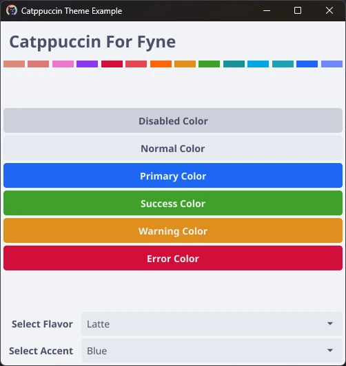
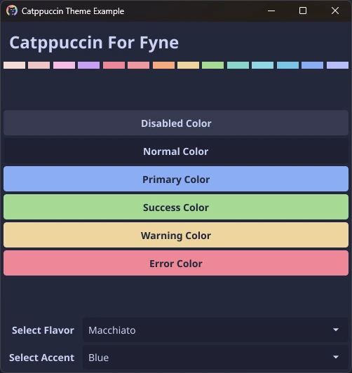
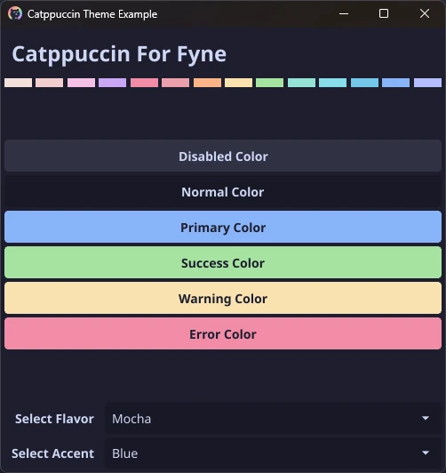

<h3 align="center">
	<br/>
	
	Catppuccin for <a href="https://fyne.io/">Fyne</a>
	
</h3>

<p align="center">
	<a href="https://github.com/catppuccin/fyne/stargazers"></a>
	<a href="https://github.com/catppuccin/fyne/issues"></a>
	<a href="https://github.com/catppuccin/fyne/contributors"></a>
</p>

<p align="center">
	
</p>

## Previews

<details>
<summary>🌻 Latte</summary>

</details>
<details>
<summary>🪴 Frappé</summary>

</details>
<details>
<summary>🌺 Macchiato</summary>

</details>
<details>
<summary>🌿 Mocha</summary>

</details>

## Usage

1. Run `go get github.com/catppuccin/fyne`
2. Add an import of `github.com/catppuccin/fyne` to your code
3. Call the app's `Settings.().SetTheme()` method with an instantiated theme struct:

   ```go
   func main() {
       a := app.New()

       ctp := catppuccin.New() // this creates a Theme struct with blue as the accent color.
                               //you can instead call NewWithAccent() for a different accent color
       ctp.SetFlavor(catppuccin.Frappe) // if you want to follow the system theme don't set flavor manually.
                                        // by default uses Latte for light and Mocha for dark
       a.Settings().SetTheme(ctp)
       ...
   }
   ```

## 💝 Thanks to

- [Michael Baklor](https://github.com/mbaklor)

&nbsp;

<p align="center">
	
</p>

<p align="center">
	Copyright &copy; 2021-present <a href="https://github.com/catppuccin" target="_blank">Catppuccin Org</a>
</p>

<p align="center">
	<a href="https://github.com/catppuccin/catppuccin/blob/main/LICENSE"></a>
</p>
